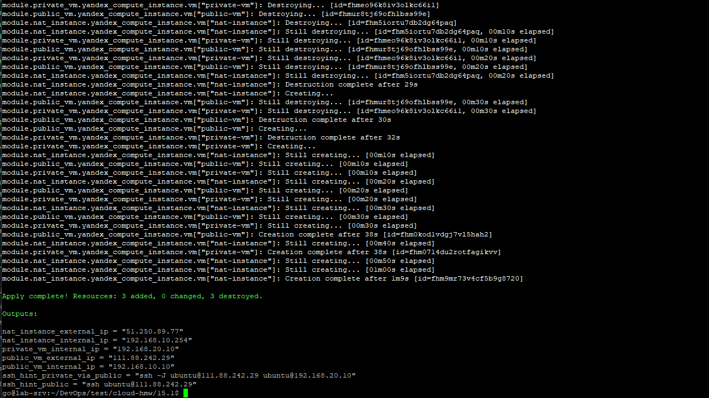
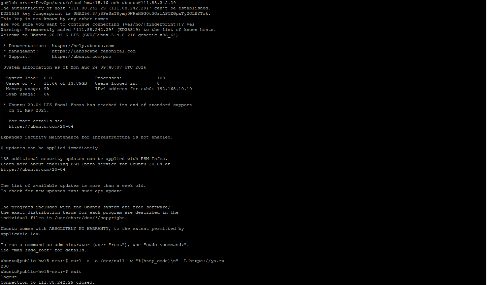
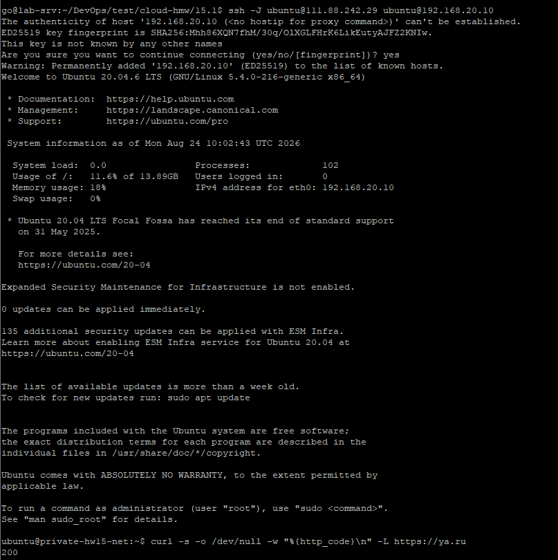
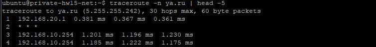

# Домашнее задание к занятию «Организация сети»

## Необходимые инструменты и компоненты

### для Yandex Cloud
| Инструмент/компонент | Зачем нужен | Проверка |
|---|---|---|
| [Terraform](https://developer.hashicorp.com/terraform/install) >= 1.5 | Разворачивает всю инфраструктуру, описанную для `yandex` | `terraform version` |
| [Yandex Cloud CLI (`yc`)](https://yandex.cloud/ru/docs/cli/quickstart) | Авторизация, получение `cloud_id`/`folder_id`/токена для Terraform (сам `yc` инфраструктуру не создаёт — это делает Terraform) | `yc version` |
| Аккаунт Yandex Cloud с активным биллингом | Без этого `yc init` и `terraform apply` не смогут ничего создать | Проверяется в [консоли](https://console.yandex.cloud) |
| SSH-ключевая пара | Доступ к создаваемым ВМ (публичный ключ передаётся через `metadata.ssh-keys`, см. `yandex/variables.tf: ssh_public_key_path`) | `ls ~/.ssh/id_rsa.pub` (сгенерировать при отсутствии: `ssh-keygen -t rsa -b 4096`) |
| `curl` (или аналог) на тестовых ВМ | Демонстрация доступа в интернет (`curl https://ya.ru`) — уже предустановлен в образе `ubuntu-2004-lts`, отдельно ставить не нужно | — |

---

## Задание 1. Yandex Cloud

### Структура проекта  

- [**Документация Terraform**](docs/DIRECTORY_STRUCTURE.md)

```
.
├── main.tf                # оркестрация: network -> public subnet -> NAT -> route table -> private subnet -> security -> VM'ы
├── providers.tf
├── variables.tf
├── outputs.tf
├── terraform.tfvars.example
└── modules/
    ├── network/            # пустая VPC-сеть
    ├── subnet/             # одна подсеть (вызывается дважды: public, private)
    ├── route_table/        # статический маршрут 0.0.0.0/0 -> NAT-инстанс
    ├── security/           # SSH + ICMP снаружи, всё — внутри VPC
    └── vm/                 # универсальная ВМ (публичный IP и cloud-init — опциональны)
```

### Решение

1. `module.network` — пустая VPC.
2. `module.public_subnet` — `192.168.10.0/24`, без кастомной route table (связность по умолчанию).
3. `module.nat_instance` — образ `fd80mrhj8fl2oe87o4e1` (готовый NAT-образ Yandex Cloud, forwarding/MASQUERADE уже настроены внутри образа), внутренний IP `192.168.10.254` (фиксированный, как в задании), публичный IP (иначе NAT-инстансу самому некуда транслировать трафик).
4. `module.private_route_table` — один статический маршрут `0.0.0.0/0 -> 192.168.10.254`.
5. `module.private_subnet` — `192.168.20.0/24`, с `route_table_id` из пункта 4 — отправляет весь исходящий трафик private-сети через NAT-инстанс.
6. `module.security` — одна security group на все инстансы: SSH+ICMP снаружи, всё разрешено внутри VPC (между public и private).
7. `module.public_vm` — `assign_nat_ip = true` (публичный IP, как требует задание).
8. `module.private_vm` — `assign_nat_ip = false` (**только** внутренний IP — прямое требование задания).

### Применение

```bash
cd yandex
cp terraform.tfvars.example terraform.tfvars
# заполнить service_account_key_file / cloud_id / folder_id

terraform init
terraform plan
terraform apply
```



### Проверка доступа к интернету

**Публичная ВМ:**
```bash
ssh ubuntu@$(terraform output -raw public_vm_external_ip)
# на самой ВМ:
curl -s -o /dev/null -w "%{http_code}\n" -L https://ya.ru
```



**Приватная ВМ** (т.к у нее нет публичного IP, заходим через jump host - "Публичную ВМ"):
```bash
terraform output ssh_hint_private_via_public
# выполнить получившуюся команду, например:
ssh -J ubuntu@<public_vm_ip> ubuntu@192.168.20.10
# на приватной ВМ:
curl -s -o /dev/null -w "%{http_code}\n" -L https://ya.ru
```



Факт прохождения через NAT — traceroute с приватной ВМ (через `192.168.10.254`):
```bash
traceroute -n ya.ru | head -5
```



---
