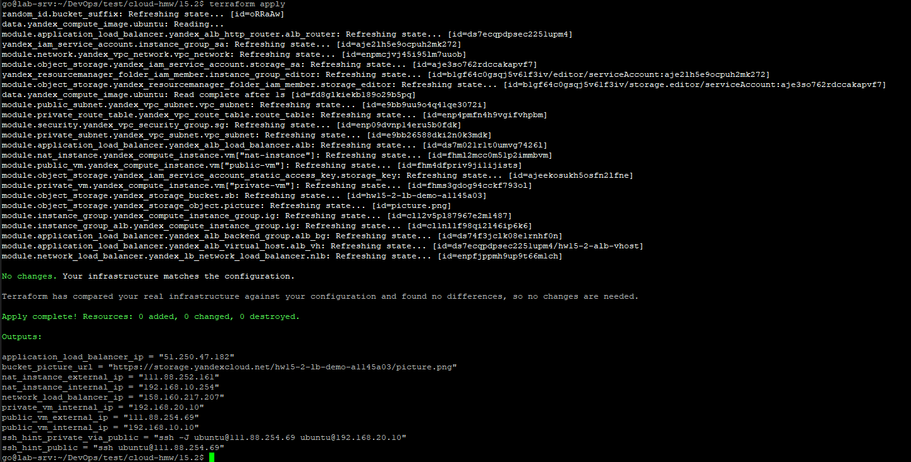
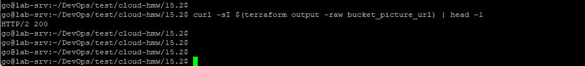
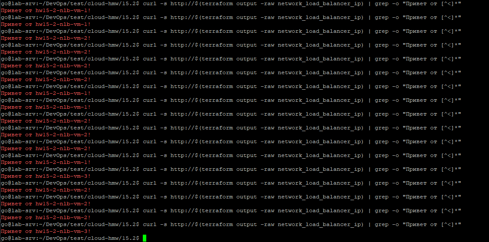
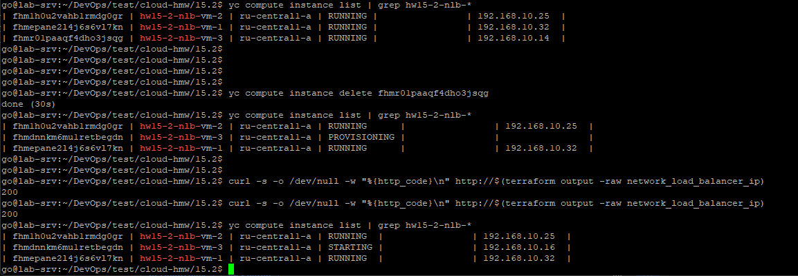
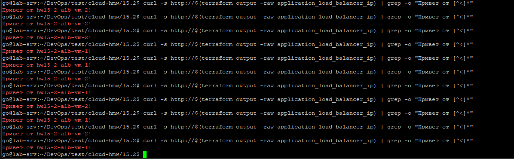

# Домашнее задание к занятию «Вычислительные мощности. Балансировщики нагрузки»

## Необходимые инструменты и компоненты

- **Terraform >= 1.5**
- **YC CLI**
-  **аккаунт Yandex Cloud с биллингом**
-  **SSH-ключ**


**см. [README](../15.1/README.md) предыдущего занятия.**

**Дополнительно:**
| Компонент | Зачем | Проверка |
|---|---|---|
| Провайдер Terraform `hashicorp/random` >= 3.5 | Генерирует уникальный суффикс имени бакета (имена бакетов уникальны глобально — см. ниже) | Подтягивается автоматически при `terraform init`|
| Файл-картинка для загрузки в бакет | По заданию — "положить в бакет файл с картинкой" | [`assets/picture.png`](./assets/picture.png)  |
| Право `storage.editor` в каталоге Yandex Cloud | Нужно сервисному аккаунту, который Terraform создаёт для работы с Object Storage (см. `modules/object_storage`) | Выдаётся автоматически самим Terraform-кодом (`yandex_resourcemanager_folder_iam_member`) |

---

## Задание 1. Yandex Cloud

### Структура

- [**Документация Terraform**](docs/DIRECTORY_STRUCTURE.md)

```
.
├── main.tf                            # оркестрация: network -> public subnet -> NAT -> route table -> private subnet -> security -> VM'ы (дополнен) блок HW15.2 в конце файла
├── providers.tf
├── variables.tf
├── outputs.tf
├── terraform.tfvars.exampl
├── modules/
│   ├── network/            # пустая VPC-сеть
│   ├── subnet/             # одна подсеть (вызывается дважды: public, private)
│   ├── route_table/        # статический маршрут 0.0.0.0/0 -> NAT-инстанс
│   ├── security/           # SSH + ICMP снаружи, всё — внутри VPC
│   ├── vm/                 # универсальная ВМ (публичный IP и cloud-init — опциональны)
│   ├── object_storage/                 # сервисный аккаунт + статический ключ + бакет + объект (публичный)
│   │   ├── main.tf
│   │   ├── variables.tf
│   │   └── outputs.tf
│   ├── instance_group/                  # Instance Group (LAMP, фиксированный размер, health check)
│   │   ├── main.tf
│   │   ├── variables.tf
│   │   └── outputs.tf
│   ├── network_load_balancer/            # NLB, подключён к target group Instance Group
│   │   ├── main.tf
│   │   ├── variables.tf
│   │   └── outputs.tf
│   └── application_load_balancer/        # ALB
│       ├── main.tf
│       ├── variables.tf
│       └── outputs.tf
├── templates/
│   └── webserver-init.sh.tpl             # user_data: стартовая страница со ссылкой на картинку
└── assets/
    └── picture.png                       # картинка для загрузки в бакет
```

### Решение

1. **Бакет с картинкой.** `module.object_storage` заводит ОТДЕЛЬНЫЙ сервисный аккаунт со статическим ключом доступа — Object Storage работает через S3-совместимый API, который не принимает обычный OAuth-токен провайдера Terraform, нужна отдельная пара `access_key`/`secret_key`. Имя бакета собирается из префикса (`var.bucket_name_prefix`) и случайного суффикса (`random_id`) — **это важно**: имена бакетов в Yandex Object Storage уникальны **глобально**, во всём облаке, а не только в каталоге, и рекомендованный заданием формат "имя_студента-дата" сам по себе не гарантирует уникальность (например, если у двух студентов совпадёт и имя, и дата). Публичным делается сам объект (`acl = "public-read"`), а не весь бакет — так безопаснее: наружу открыт конкретный файл, а не листинг всего содержимого бакета.

2. **Instance Group с LAMP.** `module.instance_group` создаёт группу **фиксированного** размера (`scale_policy.fixed_scale`, 3 ВМ по заданию — не автомасштабируемую) на образе `fd827b91d99psvq5fjit` (LAMP). Стартовая страница генерируется через `user_data` (шаблон [`templates/webserver-init.sh.tpl`](./templates/webserver-init.sh.tpl)) со ссылкой на картинку из бакета. Настроен `health_check` — HTTP-проверка порта 80, пути `/`.

3. **Связка с балансировщиком.** Блок `load_balancer` внутри Instance Group создаёт **target group** для сетевого балансировщика.

⚠️ **Важное архитектурное ограничение Yandex Cloud, из-за которого ALB спроектирован ОТДЕЛЬНО от NLB:** одна Instance Group НЕ может одновременно быть источником target group и для NLB, и для ALB — платформа явно это запрещает (см. [Документация YC](https://yandex.cloud/ru/docs/compute/concepts/instance-groups/balancers?ysclid=mtcsyuhb3907914948)), и в Terraform это два разных, взаимоисключающих блока (`load_balancer` — под NLB, `application_load_balancer` — под ALB). Поэтому модуль `instance_group` параметризован переменной `lb_type` (`"network"`/`"application"`) и вызывается **дважды**: `module.instance_group` (3 ВМ, для NLB) и `module.instance_group_alb` (2 ВМ, для ALB - переменная `var.alb_instance_group_size`).

1. **Сетевой балансировщик.** `module.network_load_balancer` — `type = "external"`, подключён к target group `module.instance_group`.

2. **Application Load Balancer.** `module.application_load_balancer` — `backend_group` + `http_router` + `virtual_host`, поверх target group второй Instance Group (`module.instance_group_alb`) — отдельно от NLB.


**Про отсутствие публичного IP у ВМ Instance Group.** ВМ обеих групп (NLB и ALB) намеренно созданы **без** публичного IP (`nat = false`) — они находятся за балансировщиком, трафик до них доходит через сам балансировщик по внутренней сети, наружу торчать им не нужно. Экономит квоту `vpc.externalAddresses.count`. Если понадобится зайти на конкретную ВМ группы напрямую по SSH для отладки — она всё равно достижима по внутреннему IP из той же подсети, например, через `public-vm` как jump host:
```bash
yc compute instance list   # найти внутренний IP нужной ВМ
ssh -J ubuntu@$(terraform output -raw public_vm_external_ip) ubuntu@<внутренний_IP_ВМ_из_группы>
```

### Применение

```bash
terraform init
terraform plan
terraform apply
```



### Проверка

**Картинка доступна из интернета:**
```bash
# Для браузера
terraform output bucket_picture_url

# Через консоль
curl -sI $(terraform output -raw bucket_picture_url) | head -1
# Ожидаем `HTTP/2 200`.
```



**Веб-страница за сетевым балансировщиком:**
```bash

curl -s http://$(terraform output -raw network_load_balancer_ip) | grep -o "Привет от [^<]*"
```
При повторе запроса несколько раз — `hostname` в ответе должен меняться (запросы уходят на разные ВМ группы).



**Проверка отказоустойчивости** ("проверить работоспособность, удалив одну или несколько ВМ"):
```bash
yc compute instance list | grep hw15-2-nlb-*
yc compute instance delete <id_одной_из_ВМ>

# Практически сразу — балансировщик уже не отправляет трафик на удалённую ВМ
curl -s -o /dev/null -w "%{http_code}\n" http://$(terraform output -raw network_load_balancer_ip)

# Через ~30-60 секунд Instance Group сама восстанавливает недостающую реплику
yc compute instance list | grep hw15-2-nlb-*
```
**Ожидаемый результат:** несмотря на удаление ВМ, балансировщик всё это время продолжает отвечать `200` — трафик перераспределяется на оставшиеся здоровые ВМ; через некоторое время группа снова показывает 3 из 3 ВМ.



**Проверка ALB**: 
```bash
curl -s http://$(terraform output -raw application_load_balancer_ip) | grep -o "Привет от [^<]*"
```



---
