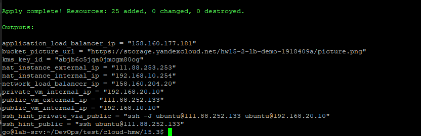
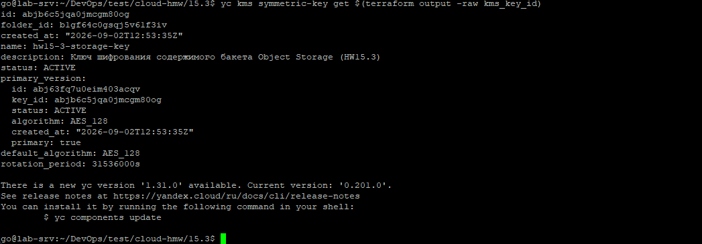
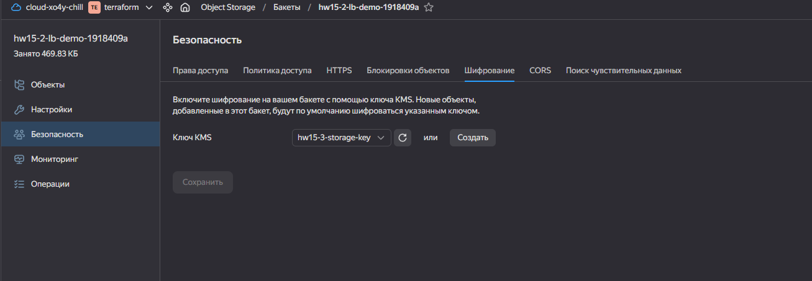
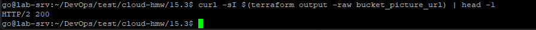

# Домашнее задание к занятию «Безопасность в облачных провайдерах»

## Подготовка к выполнению задания

Задание продолжает инфраструктуру предыдущих занятий — используется тот же бакет Object Storage, что был создан в HW15.2 (`module.object_storage` в [`main.tf`](./main.tf)), только теперь с добавленным шифрованием.


## Необходимые инструменты и компоненты

- **Terraform >= 1.5**
- **YC CLI**
-  **аккаунт Yandex Cloud с биллингом**
-  **SSH-ключ**


**см. [README](../15.2/README.md) предыдущего занятия.**


---

## Задание 1. Yandex Cloud — шифрование бакета KMS-ключом

### Структура

- [**Документация Terraform**](docs/DIRECTORY_STRUCTURE.md)

```
.
├── main.tf                            # оркестрация: network -> public subnet -> NAT -> route table -> private subnet -> security -> VM'ы (дополнен) блок HW15.2 в конце файла
├── providers.tf
├── variables.tf
├── outputs.tf
├── terraform.tfvars.exampl
├── modules/
│   ├── network/            # пустая VPC-сеть
│   ├── subnet/             # одна подсеть (вызывается дважды: public, private)
│   ├── route_table/        # статический маршрут 0.0.0.0/0 -> NAT-инстанс
│   ├── security/           # SSH + ICMP снаружи, всё — внутри VPC
│   ├── vm/                 # универсальная ВМ (публичный IP и cloud-init — опциональны)
│   ├── object_storage/                   # сервисный аккаунт + статический ключ + бакет + объект (публичный)
│   │   ├── main.tf                       # (дополнен) yandex_kms_symmetric_key + право на ключ + server_side_encryption_configuration на бакете
│   │   ├── variables.tf                  # (дополнен) kms_key_name / kms_default_algorithm / kms_rotation_period
│   │   └── outputs.tf                    # (дополнен) kms_key_id
│   ├── instance_group/                   # Instance Group (LAMP, фиксированный размер, health check)
│   │   ├── main.tf
│   │   ├── variables.tf
│   │   └── outputs.tf
│   ├── network_load_balancer/            # NLB, подключён к target group Instance Group
│   │   ├── main.tf
│   │   ├── variables.tf
│   │   └── outputs.tf
│   └── application_load_balancer/        # ALB
│       ├── main.tf
│       ├── variables.tf
│       └── outputs.tf
├── templates/
│   └── webserver-init.sh.tpl             # user_data: стартовая страница со ссылкой на картинку
└── assets/
    └── picture.png                       # картинка для загрузки в бакет
```

### Решение

1. **Симметричный KMS-ключ** (`yandex_kms_symmetric_key.kms_key`) — `default_algorithm = "AES_128"`, `rotation_period = "8760h"` (1 год, автоматическая ротация).

2. **Право на использование ключа.** Шифрование/расшифровку объектов при обращении к бакету фактически выполняет **тот же сервисный аккаунт**, что уже работает с Object Storage через статический ключ (`storage_sa` из HW15.2). Этому же аккаунту нужна ещё одна роль — `kms.keys.encrypterDecrypter`. Выдана на уровне **каталога** через `yandex_resourcemanager_folder_iam_member` — это способ, прямо рекомендованный официальной документацией Yandex Cloud для управления доступом к KMS-ключам из Terraform.

3. **Включение шифрования на бакете:**
   ```hcl
   server_side_encryption_configuration {
     rule {
       apply_server_side_encryption_by_default {
         kms_master_key_id = yandex_kms_symmetric_key.kms_key.id
         sse_algorithm      = "aws:kms"
       }
     }
   }
   ```
   `sse_algorithm = "aws:kms"` — единственное поддерживаемое значение (S3-совместимый API).

4. **Гонка состояния, которую нужно предусмотреть явно.** И создание самого бакета с уже включённым шифрованием, и загрузка картинки в него, должны происходить **после** того, как право `kms.keys.encrypterDecrypter` реально применилось — иначе первая же попытка что-то зашифровать провалится с ошибкой доступа. Добавлена явная `depends_on` и на `yandex_storage_bucket.sb`, и на `yandex_storage_object.picture` — та же логика, что уже применялась в HW15.2 для `storage.editor` (см. `depends_on` у `yandex_iam_service_account_static_access_key`).

⚠️ **Шифрование и публичный доступ к картинке.** SSE-KMS шифрует данные только "на диске" (at rest) внутри Object Storage — при скачивании по публичной ссылке сервис сам расшифровывает объект на лету и отдаёт обычный, нешифрованный HTTP-ответ.

⚠️ **Про `lifecycle.prevent_destroy` (закомментирован, не включён).** Официальная документация настоятельно рекомендует добавлять `prevent_destroy = true` для KMS-ключей в продакшене — удаление ключа делает **невосстановимыми** все данные, зашифрованные им. Здесь это сознательно не включено: это учебный стенд, который предполагается свободно поднимать и разрушать через `terraform destroy`, а `prevent_destroy = true` заблокировал бы именно эту команду.

### Применение

```bash
terraform init      # если ранее не инициализировали модуль с новыми ресурсами
terraform plan       # ожидаем: добавление yandex_kms_symmetric_key + yandex_resourcemanager_folder_iam_member + изменение (in-place) yandex_storage_bucket
terraform apply
```



### Проверка

**Ключ создан и виден:**
```bash
terraform output kms_key_id
yc kms symmetric-key get $(terraform output -raw kms_key_id)
```



**Бакет действительно зашифрован этим ключом:**

В консоли: Object Storage → бакет → вкладка «Настройки» → «Шифрование» — должен быть указан созданный KMS-ключ.




**Картинка по-прежнему доступна публично, несмотря на шифрование:**
```bash
curl -sI $(terraform output -raw bucket_picture_url) | head -1
```
Ожидаем `HTTP/2 200` — то же самое, что и в HW15.2, шифрование не поменяло видимое поведение для конечного пользователя.



---
